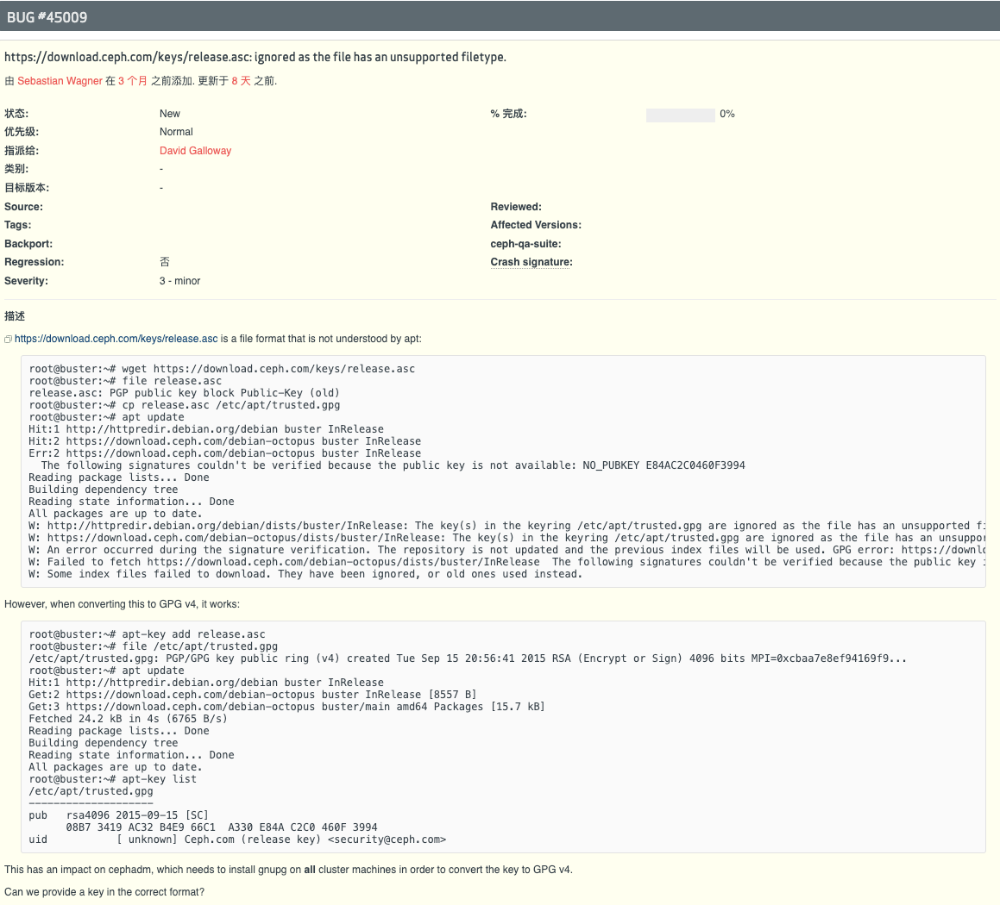

## 搭建环境

主机名|IP|服务|系统
---|:--:|:---|:--
ceph-1|172.16.90.3|mon,osd,mgr|ubuntu 18.04.4
ceph-2|172.16.90.4|mon,osd,mgr|ubuntu 18.04.4
ceph-3|172.16.70.9|osd|ubuntu 18.04.4

## 1 前期准备

### 配置host

```shell
ceph@ceph-1:~$ cd /etc
ceph@ceph-1:/etc$ sudo vim hosts

127.0.0.1       localhost
172.16.90.3   ceph-1
172.16.90.4   ceph-2
172.16.70.9    ceph-3
# The following lines are desirable for IPv6 capable hosts
::1     localhost ip6-localhost ip6-loopback
ff02::1 ip6-allnodes
ff02::2 ip6-allrouters
```

```shell
ceph@ceph-1:/etc$ ping ceph-2
PING ceph-2 (172.16.90.4) 56(84) bytes of data.
64 bytes from ceph-2 (172.16.90.4): icmp_seq=1 ttl=64 time=0.597 ms
64 bytes from ceph-2 (172.16.90.4): icmp_seq=2 ttl=64 time=0.246 ms
^C
--- ceph-2 ping statistics ---
2 packets transmitted, 2 received, 0% packet loss, time 1023ms
rtt min/avg/max/mdev = 0.246/0.421/0.597/0.176 ms
ceph@ceph-1:/etc$ ping ceph-3
PING ceph-3 (172.16.70.9) 56(84) bytes of data.
64 bytes from ceph-3 (172.16.70.9): icmp_seq=1 ttl=63 time=0.413 ms
64 bytes from ceph-3 (172.16.70.9): icmp_seq=2 ttl=63 time=0.386 ms
64 bytes from ceph-3 (172.16.70.9): icmp_seq=3 ttl=63 time=0.305 ms
^C
--- ceph-3 ping statistics ---
3 packets transmitted, 3 received, 0% packet loss, time 2037ms
rtt min/avg/max/mdev = 0.305/0.368/0.413/0.045 ms
```

### 配置sudo免密(可选)(方便操作)

```shell
root@ceph-1:/etc# sudo chmod 744 sudoers
root@ceph-1:/etc# sudo vim sudoers
```
在后面追加一行

> ceph ALL=(root) NOPASSWD:ALL

恢复文件权限然后重启

```
ceph@ceph-1:/etc$ sudo chmod 0440  sudoers
ceph@ceph-1:/etc$ sudo reboot
```

## 2.环境安装

### 安装docker环境

```shell
sudo apt-get update && apt-get -y install \
    apt-transport-https \
    ca-certificates \
    curl \
    gnupg-agent \
    software-properties-common
```
```
curl -fsSL https://mirrors.tuna.tsinghua.edu.cn/docker-ce/linux/ubuntu/gpg | sudo apt-key add -
OK
```
```
sudo add-apt-repository "deb [arch=amd64] https://mirrors.tuna.tsinghua.edu.cn/docker-ce/linux/ubuntu $(lsb_release -cs) stable"
Hit:1 https://mirrors.tuna.tsinghua.edu.cn/ubuntu bionic InRelease
Hit:2 https://mirrors.tuna.tsinghua.edu.cn/ubuntu bionic-updates InRelease
Hit:3 https://mirrors.tuna.tsinghua.edu.cn/ubuntu bionic-backports InRelease
Hit:4 https://mirrors.tuna.tsinghua.edu.cn/ubuntu bionic-security InRelease
Get:5 https://mirrors.tuna.tsinghua.edu.cn/docker-ce/linux/ubuntu bionic InRelease [64.4 kB]
Get:6 https://mirrors.tuna.tsinghua.edu.cn/docker-ce/linux/ubuntu bionic/stable amd64 Packages [12.5 kB]
Fetched 76.9 kB in 1s (99.0 kB/s)
```
```shell
sudo apt-get update && sudo apt-get install -y docker-ce docker-ce-cli containerd.io
```

### 安装ceph
```
ceph@ceph-1:~$ curl --silent --remote-name --location https://github.com/ceph/ceph/raw/octopus/src/cephadm/cephadm
ceph@ceph-1:~$ chmod +x cephadm
```
```
ceph@ceph-1:~$ sudo ./cephadm add-repo --release octopus
INFO:root:Installing repo GPG key from https://download.ceph.com/keys/release.as                                             c...
INFO:root:Installing repo file at /etc/apt/sources.list.d/ceph.list...
ceph@ceph-1:~$ sudo apt update
Hit:1 https://mirrors.tuna.tsinghua.edu.cn/ubuntu bionic InRelease
Hit:2 https://mirrors.tuna.tsinghua.edu.cn/ubuntu bionic-updates InRelease
Hit:3 https://mirrors.tuna.tsinghua.edu.cn/ubuntu bionic-backports InRelease
Hit:4 https://mirrors.tuna.tsinghua.edu.cn/ubuntu bionic-security InRelease
Hit:5 https://mirrors.tuna.tsinghua.edu.cn/docker-ce/linux/ubuntu bionic InRelea                                             se
Get:6 https://download.ceph.com/debian-octopus bionic InRelease [8563 B]
Err:6 https://download.ceph.com/debian-octopus bionic InRelease
  The following signatures couldn't be verified because the public key is not av                                             ailable: NO_PUBKEY E84AC2C0460F3994
Reading package lists... Done
W: https://mirrors.tuna.tsinghua.edu.cn/ubuntu/dists/bionic/InRelease: The key(s) in the keyring /etc/apt/trusted.gpg.d/ceph.release.gpg are ignored as the file has an unsupported filetype.
W: https://mirrors.tuna.tsinghua.edu.cn/ubuntu/dists/bionic-updates/InRelease: The key(s) in the keyring /etc/apt/trusted.gpg.d/ceph.release.gpg are ignored as the file has an unsupported filetype.
W: https://mirrors.tuna.tsinghua.edu.cn/ubuntu/dists/bionic-backports/InRelease: The key(s) in the keyring /etc/apt/trusted.gpg.d/ceph.release.gpg are ignored as the file has an unsupported filetype.
W: https://mirrors.tuna.tsinghua.edu.cn/ubuntu/dists/bionic-security/InRelease: The key(s) in the keyring /etc/apt/trusted.gpg.d/ceph.release.gpg are ignored as the file has an unsupported filetype.
W: https://mirrors.tuna.tsinghua.edu.cn/docker-ce/linux/ubuntu/dists/bionic/InRelease: The key(s) in the keyring /etc/apt/trusted.gpg.d/ceph.release.gpg are ignored as the file has an unsupported filetype.
W: https://download.ceph.com/debian-octopus/dists/bionic/InRelease: The key(s) in the keyring /etc/apt/trusted.gpg.d/ceph.release.gpg are ignored as the file has an unsupported filetype.
W: GPG error: https://download.ceph.com/debian-octopus bionic InRelease: The following signatures couldn't be verified because the public key is not available: NO_PUBKEY E84AC2C0460F3994
E: The repository 'https://download.ceph.com/debian-octopus bionic InRelease' is not signed.
N: Updating from such a repository can't be done securely, and is therefore disabled by default.
N: See apt-secure(8) manpage for repository creation and user configuration details.
```
可以看到，apt update 出错了，这里有一个坑，官方的apt key是旧版本的，而cephadm安装key的方法是直接拷贝到apt里面，导致出错，错误详细见[链接](https://tracker.ceph.com/issues/45009)


### 解决方法:

先删除cephadm拷贝的key
```
ceph@ceph-1:/etc$ cd apt
ceph@ceph-1:/etc/apt$ ls
apt.conf    auth.conf.d    sources.list    sources.list.save  trusted.gpg
apt.conf.d  preferences.d  sources.list.d  sources.list~      trusted.gpg.d
ceph@ceph-1:/etc/apt$ cd trusted.gpg.d/
ceph@ceph-1:/etc/apt/trusted.gpg.d$ ls
ceph.release.gpg  ubuntu-keyring-2012-archive.gpg  ubuntu-keyring-2012-cdimage.gpg  ubuntu-keyring-2018-archive.gpg
ceph@ceph-1:/etc/apt/trusted.gpg.d$ sudo rm -rf ceph.release.gpg
```
再手动下载添加([下载地址](https://download.ceph.com/keys/release.as))
```
ceph@ceph-1:~$ sudo apt-key add release.asc
OK
```
再更新一下
```
ceph@ceph-1:~$ sudo apt update
Hit:1 https://mirrors.tuna.tsinghua.edu.cn/ubuntu bionic InRelease
Hit:2 https://mirrors.tuna.tsinghua.edu.cn/ubuntu bionic-updates InRelease
Hit:3 https://mirrors.tuna.tsinghua.edu.cn/ubuntu bionic-backports InRelease
Hit:4 https://mirrors.tuna.tsinghua.edu.cn/ubuntu bionic-security InRelease
Hit:5 https://mirrors.tuna.tsinghua.edu.cn/docker-ce/linux/ubuntu bionic InRelease
Get:6 https://download.ceph.com/debian-octopus bionic InRelease [8563 B]
Get:7 https://download.ceph.com/debian-octopus bionic/main amd64 Packages [15.9 kB]
Get:8 https://download.ceph.com/debian-octopus bionic/main i386 Packages [3266 B]
Fetched 19.2 kB in 2s (9537 B/s)
Reading package lists... Done
Building dependency tree
Reading state information... Done
All packages are up to date.
```
### 顺便换个源
```
ceph@ceph-1:/etc/apt/sources.list.d$ cat ceph.list
deb https://download.ceph.com/debian-octopus bionic main
```
可以看到cephadm添加了这一行，把地址改为国内源即可

> deb https://mirrors.tuna.tsinghua.edu.cn/ceph/debian-octopus/ bionic main

```
ceph@ceph-1:/etc/apt/sources.list.d$ sudo apt update
```
然后通过cephadm安装软件包
```
ceph@ceph-1:~$ sudo ./cephadm install
INFO:root:Installing packages ['cephadm']...
ceph@ceph-1:~$ which cephadm
/usr/sbin/cephadm
```
其实实际上就是三步，添加apt key，根据版本导入ceph源，然后apt install cephadm，如果通过脚本或ansible可以直接手动就好了

### 导入镜像(如果当前环境网络没有问题可以跳过)
打开cephadm的内部可以看出，需要5个镜像


```
docker.io/ceph/ceph:v15
prom/prometheus:latest
prom/node-exporter:latest
ceph/ceph-grafana:latest
prom/alertmanager:latest
```
根据后面搭建完成的情况看，第一个是必须，后四个最好有

从其他有网络的机docker pull后 docker save 导出，导入到环境机内
```
ceph@ceph-1:~$ sudo docker load -i ceph.tar
eb29745b8228: Loading layer  222.6MB/222.6MB
64ba9041a276: Loading layer  782.9MB/782.9MB
Loaded image: ceph/ceph:v15
ceph@ceph-3:~$ sudo docker load -i promethus.tar
1da8e4c8d307: Loading layer [==================================================>]  1.437MB/1.437MB
7a151fe67625: Loading layer [==================================================>]  2.595MB/2.595MB
b260acf93b38: Loading layer [==================================================>]  87.18MB/87.18MB
2aca26a0561a: Loading layer [==================================================>]  49.98MB/49.98MB
78b7236da63d: Loading layer [==================================================>]  3.584kB/3.584kB
598b46af43c3: Loading layer [==================================================>]  13.31kB/13.31kB
c416dca9c497: Loading layer [==================================================>]  28.16kB/28.16kB
c41930d39a5d: Loading layer [==================================================>]  13.31kB/13.31kB
883efb2f2811: Loading layer [==================================================>]   5.12kB/5.12kB
a9374a821205: Loading layer [==================================================>]  113.2kB/113.2kB
c87cd4adecc5: Loading layer [==================================================>]  3.072kB/3.072kB
724129e57a6e: Loading layer [==================================================>]   5.12kB/5.12kB
Loaded image: prom/prometheus:v2.18.1
ceph@ceph-3:~$ sudo docker load -i alertmanager.tar
fef01fa2517b: Loading layer [==================================================>]  23.99MB/23.99MB
3a76306b204d: Loading layer [==================================================>]  28.87MB/28.87MB
b5411b0aebd2: Loading layer [==================================================>]  3.072kB/3.072kB
50bc703e0953: Loading layer [==================================================>]  3.584kB/3.584kB
Loaded image: prom/alertmanager:latest
ceph@ceph-3:~$ sudo docker load -i ceph-grafana.tar
5ded7fadc840: Loading layer [==================================================>]  519.2MB/519.2MB
Loaded image: ceph/ceph-grafana:latest
ceph@ceph-3:~$ sudo docker load -i node-exporter.tar
bef00f7ac5a9: Loading layer [==================================================>]  5.424MB/5.424MB
bb208cc3e926: Loading layer [==================================================>]  2.743MB/2.743MB
53fe7fa9c07c: Loading layer [==================================================>]  19.66MB/19.66MB
Loaded image: prom/node-exporter:latest
```
### 启用root

其实，在Debian/Ubunut系中，root是不建议开启的，但尽管ceph在文档中说支持非root用户，


但实际参数没有
```
ceph@ceph-1:~$ sudo ceph cephadm set-user ceph
no valid command found; 10 closest matches:
cephadm set-ssh-config
cephadm clear-ssh-config
cephadm get-ssh-config
cephadm generate-key
cephadm set-priv-key
cephadm set-pub-key
cephadm clear-key
cephadm get-pub-key
cephadm get-user
cephadm check-host <host> [<addr>]
Error EINVAL: invalid command
```
```
ceph@ceph-1:/etc/ceph$ sudo cephadm bootstrap --mon-ip 172.16.90.3 --skip-pull --allow-overwrite -ssh-user ceph
usage: cephadm [-h] [--image IMAGE] [--docker] [--data-dir DATA_DIR]
               [--log-dir LOG_DIR] [--logrotate-dir LOGROTATE_DIR]
               [--unit-dir UNIT_DIR] [--verbose] [--timeout TIMEOUT]
               [--retry RETRY] [--env ENV]
               {version,pull,inspect-image,ls,list-networks,adopt,rm-daemon,rm-cluster,run,shell,enter,ceph-volume,unit,logs,bootstrap,deploy,check-host,prepare-host,add-repo,rm-repo,install}
               ...
cephadm: error: unrecognized arguments: -ssh-user ceph
```
这些参数在官方文档中均存在，一番折腾后放弃，改为开启root密码和root的ssh登陆
```
ceph@ceph-2:~$ sudo passwd root
Enter new UNIX password:
Retype new UNIX password:
passwd: password updated successfully
```
在sshd_config的
> #PermitRootLogin prohibit-password后加上一行

>PermitRootLogin yes
```
ceph@ceph-2:~$ sudo vim /etc/ssh/sshd_config
ceph@ceph-2:~$ sudo systemctl restart sshd
ceph@ceph-2:~$ cat /etc/ssh/sshd_config | grep PermitRootLogin
#PermitRootLogin prohibit-password
PermitRootLogin yes
# the setting of "PermitRootLogin without-password".
```

接着在其他机上重复hosts，docker安装，sudo免密(可选),镜像导入(可选),开启root密码和root的ssh(cephadm只在一台机安装)

## 3.ceph初始化
```
ceph@ceph-1:~$ sudo mkdir -p /etc/ceph
```
如果你不是非外网环境通过导入镜像，则不用--skip-pull参数
```
ceph@ceph-1:~$ sudo cephadm bootstrap --mon-ip 172.16.90.3 --skip-pull
INFO:cephadm:Verifying podman|docker is present...
INFO:cephadm:Verifying lvm2 is present...
INFO:cephadm:Verifying time synchronization is in place...
INFO:cephadm:Unit systemd-timesyncd.service is enabled and running
INFO:cephadm:Repeating the final host check...
INFO:cephadm:podman|docker (/usr/bin/docker) is present
INFO:cephadm:systemctl is present
INFO:cephadm:lvcreate is present
INFO:cephadm:Unit systemd-timesyncd.service is enabled and running
INFO:cephadm:Host looks OK
INFO:root:Cluster fsid: d668a1a0-c90f-11ea-b26d-000c29a0fbf7
INFO:cephadm:Verifying IP 172.16.90.3 port 3300 ...
INFO:cephadm:Verifying IP 172.16.90.3 port 6789 ...
INFO:cephadm:Mon IP 172.16.90.3 is in CIDR network 172.16.90.0/24
INFO:cephadm:Extracting ceph user uid/gid from container image...
INFO:cephadm:Creating initial keys...
INFO:cephadm:Creating initial monmap...
INFO:cephadm:Creating mon...
INFO:cephadm:Waiting for mon to start...
INFO:cephadm:Waiting for mon...
INFO:cephadm:mon is available
INFO:cephadm:Assimilating anything we can from ceph.conf...
INFO:cephadm:Generating new minimal ceph.conf...
INFO:cephadm:Restarting the monitor...
INFO:cephadm:Setting mon public_network...
INFO:cephadm:Creating mgr...
INFO:cephadm:Wrote keyring to /etc/ceph/ceph.client.admin.keyring
INFO:cephadm:Wrote config to /etc/ceph/ceph.conf
INFO:cephadm:Waiting for mgr to start...
INFO:cephadm:Waiting for mgr...
INFO:cephadm:mgr not available, waiting (1/10)...
INFO:cephadm:mgr not available, waiting (2/10)...
INFO:cephadm:mgr not available, waiting (3/10)...
INFO:cephadm:mgr not available, waiting (4/10)...
INFO:cephadm:mgr is available
INFO:cephadm:Enabling cephadm module...
INFO:cephadm:Waiting for the mgr to restart...
INFO:cephadm:Waiting for Mgr epoch 5...
INFO:cephadm:Mgr epoch 5 is available
INFO:cephadm:Setting orchestrator backend to cephadm...
INFO:cephadm:Generating ssh key...
INFO:cephadm:Wrote public SSH key to to /etc/ceph/ceph.pub
INFO:cephadm:Adding key to root@localhost's authorized_keys...
INFO:cephadm:Adding host ceph-1...
INFO:cephadm:Deploying mon service with default placement...
INFO:cephadm:Deploying mgr service with default placement...
INFO:cephadm:Deploying crash service with default placement...
INFO:cephadm:Enabling mgr prometheus module...
INFO:cephadm:Deploying prometheus service with default placement...
INFO:cephadm:Deploying grafana service with default placement...
INFO:cephadm:Deploying node-exporter service with default placement...
INFO:cephadm:Deploying alertmanager service with default placement...
INFO:cephadm:Enabling the dashboard module...
INFO:cephadm:Waiting for the mgr to restart...
INFO:cephadm:Waiting for Mgr epoch 13...
INFO:cephadm:Mgr epoch 13 is available
INFO:cephadm:Generating a dashboard self-signed certificate...
INFO:cephadm:Creating initial admin user...
INFO:cephadm:Fetching dashboard port number...
INFO:cephadm:Ceph Dashboard is now available at:

             URL: https://ceph-1:8443/
            User: admin
        Password: np3que7wjc

INFO:cephadm:You can access the Ceph CLI with:

        sudo /usr/sbin/cephadm shell --fsid d668a1a0-c90f-11ea-b26d-000c29a0fbf7 -c /etc/ceph/ceph.conf -k /etc/ceph/ceph.client.admin.keyring

INFO:cephadm:Please consider enabling telemetry to help improve Ceph:

        ceph telemetry on

For more information see:

        https://docs.ceph.com/docs/master/mgr/telemetry/

INFO:cephadm:Bootstrap complete.
```
安装ceph操作包
```
ceph@ceph-1:~$ sudo apt install ceph-common
```

## 4.完善集群
### 导入其他服务器
```
ceph@ceph-1:/etc/ceph$ ssh-copy-id -f -i /etc/ceph/ceph.pub root@ceph-2
/usr/bin/ssh-copy-id: INFO: Source of key(s) to be installed: "/etc/ceph/ceph.pub"
root@ceph-2's password:

Number of key(s) added: 1

Now try logging into the machine, with:   "ssh 'root@ceph-2'"
and check to make sure that only the key(s) you wanted were added.

ceph@ceph-1:/etc/ceph$ ssh-copy-id -f -i /etc/ceph/ceph.pub root@ceph-3
/usr/bin/ssh-copy-id: INFO: Source of key(s) to be installed: "/etc/ceph/ceph.pub"
root@ceph-3's password:

Number of key(s) added: 1

Now try logging into the machine, with:   "ssh 'root@ceph-3'"
and check to make sure that only the key(s) you wanted were added.
```
```
ceph@ceph-1:~$ sudo ceph orch host add ceph-2
Added host 'ceph-2'
ceph@ceph-1:~$ sudo ceph orch host add ceph-3
Added host 'ceph-3'
ceph@ceph-1:~$ sudo ceph orch host ls
HOST    ADDR    LABELS  STATUS
ceph-1  ceph-1
ceph-2  ceph-2
ceph-3  ceph-3
```

### 加入osd

先看看磁盘
```
ceph@ceph-1:~$ sudo fdisk -l
Disk /dev/sda: 30 GiB, 32212254720 bytes, 62914560 sectors
Units: sectors of 1 * 512 = 512 bytes
Sector size (logical/physical): 512 bytes / 512 bytes
I/O size (minimum/optimal): 512 bytes / 512 bytes
Disklabel type: dos
Disk identifier: 0x3d5859e2

Device     Boot Start      End  Sectors Size Id Type
/dev/sda1  *     2048 62912511 62910464  30G 8e Linux LVM


Disk /dev/sdb: 300 GiB, 322122547200 bytes, 629145600 sectors
Units: sectors of 1 * 512 = 512 bytes
Sector size (logical/physical): 512 bytes / 512 bytes
I/O size (minimum/optimal): 512 bytes / 512 bytes


Disk /dev/mapper/ceph--1--vg-root: 29 GiB, 31172067328 bytes, 60882944 sectors
Units: sectors of 1 * 512 = 512 bytes
Sector size (logical/physical): 512 bytes / 512 bytes
I/O size (minimum/optimal): 512 bytes / 512 bytes


Disk /dev/mapper/ceph--1--vg-swap_1: 976 MiB, 1023410176 bytes, 1998848 sectors
Units: sectors of 1 * 512 = 512 bytes
Sector size (logical/physical): 512 bytes / 512 bytes
I/O size (minimum/optimal): 512 bytes / 512 bytes
```
我们导入sdb硬盘
```
ceph@ceph-1:~$ sudo ceph orch daemon add osd ceph-1:/dev/sdb
Created osd(s) 0 on host 'ceph-1'
ceph@ceph-1:~$ sudo ceph orch daemon add osd ceph-2:/dev/sdb
Created osd(s) 1 on host 'ceph-2'
ceph@ceph-1:~$ sudo ceph orch daemon add osd ceph-3:/dev/sdb
Created osd(s) 2 on host 'ceph-3'
```

## 5.验证
```
ceph@ceph-1:~$ sudo ceph -s
  cluster:
    id:     d668a1a0-c90f-11ea-b26d-000c29a0fbf7
    health: HEALTH_WARN
            failed to probe daemons or devices
            clock skew detected on mon.ceph-2

  services:
    mon: 2 daemons, quorum ceph-1,ceph-2 (age 112s)
    mgr: ceph-1.ieitdi(active, since 6m), standbys: ceph-3.nrfhhu
    osd: 3 osds: 2 up (since 22s), 2 in (since 22s)

  data:
    pools:   1 pools, 1 pgs
    objects: 0 objects, 0 B
    usage:   2.0 GiB used, 598 GiB / 600 GiB avail
    pgs:     1 active+undersized

```
```
ceph@ceph-1:~$ sudo ceph -s
  cluster:
    id:     d668a1a0-c90f-11ea-b26d-000c29a0fbf7
    health: HEALTH_WARN
            clock skew detected on mon.ceph-2

  services:
    mon: 2 daemons, quorum ceph-1,ceph-2 (age 2m)
    mgr: ceph-1.ieitdi(active, since 6m), standbys: ceph-3.nrfhhu
    osd: 3 osds: 3 up (since 50s), 3 in (since 50s)

  data:
    pools:   1 pools, 1 pgs
    objects: 0 objects, 0 B
    usage:   3.0 GiB used, 897 GiB / 900 GiB avail
    pgs:     1 active+clean
```
当看到osd数量为刚才添加的3时，则集群就完成了

再看看dashboard


至此，ceph集群初始化完毕，再根据需求使用cephfs或rbd

附上cephfs的创建命令
```
sudo ceph orch apply mds cephfs --placement="1 ceph-1"   #1为数量，创建cephfs前要先新建mds
sudo ceph osd pool create cephfs_data
sudo ceph osd pool create cephfs_metadata
sudo ceph fs new cephfs cephfs_metadata cephfs_data
sudo ceph fs ls
sudo ceph mds stat
然后就可以在你的dashboard看到cephfs了
```
连接cephfs
```
sudo ceph auth get client.admin  #先获取连接密钥
sudo mount -t ceph 192.168.90.3:6789:/ /mnt/fs -o name=admin,secret=AQCKcf1eLigAGRAAc/0TeHG2zBy+kuqdM8MItw== #然后可以挂载了
```
测试速度
```
rados bench seconds mode [ -b objsize ] [ -t threads ]
参数说明：mode 可以是 write、seq 、rand。 seq和rand分别是顺序读、随机读压力测试，默认对象尺寸是4MB，默认模拟线程数为16。加--no-cleanup是为了测试后面的读
rados bench -p pool名称 30 write -b blocksize --no-cleanup
rados bench -p scbench 30 seq
rados bench -p scbench 30 rand
```