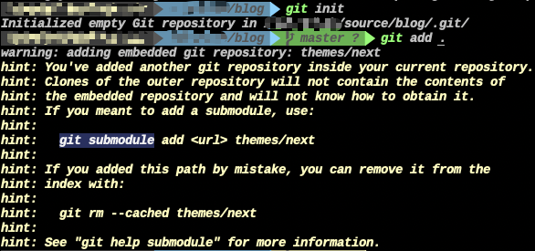
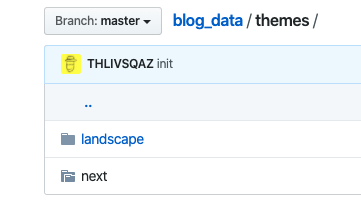
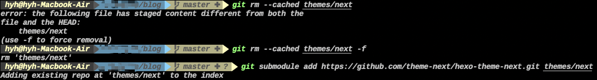
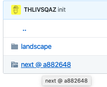

决定将github page文件扔上github，用git管理

因为用了next的目录在里面，因此报一下错误

```
hint: You've added another git repository inside your current repository.
```

```
hint: Clones of the outer repository will not contain the contents of
hint: the embedded repository and will not know how to obtain it.
hint: If you meant to add a submodule, use:
hint:
hint: 	git submodule add <url> themes/next
hint:
hint: If you added this path by mistake, you can remove it from the
hint: index with:
hint:
hint: 	git rm --cached themes/next
hint:
hint: See "git help submodule" for more information.
```
因为我们的repo已经存在，不能使用git submodule add url path的命令


上传的目录为空


## 解决办法:

先执行
```
git rm --cached path
```

在执行
```
git submodule add url path
```

即可


