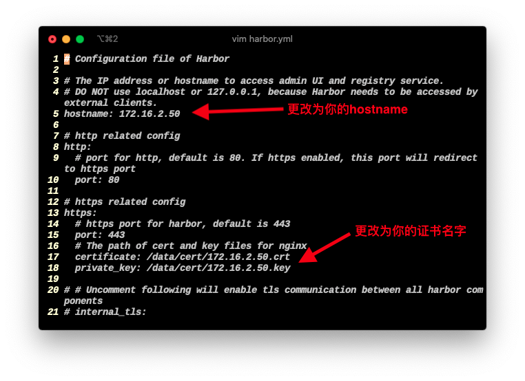
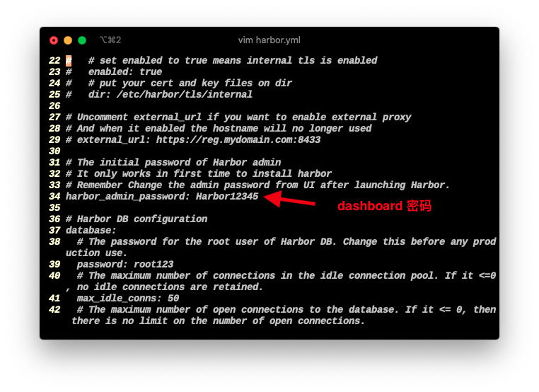

## 介绍

harbor 比起docker官方的registry更好用一些，具体介绍见[此](https://goharbor.io/)

## 1.环境准备

首先需要docker环境，这里就不做详细docker安装记录了

### 生成key

docker上传镜像时默认使用443端口ssl，同时为了安全性，使用自签ssl证书，有条件的也可以用合法证书

下面过程与[官方操作](https://goharbor.io/docs/2.0.0/install-config/configure-https/)一致

+ 生成CA

```shell
$ mkdir key
harbor@store:~$ cd key/
harbor@store:~/key$ openssl genrsa -out ca.key 4096
Generating RSA private key, 4096 bit long modulus (2 primes)
.....................................................................................................................................................................++++
..............++++
e is 65537 (0x010001)
```
```
$ openssl req -x509 -new -nodes -sha512 -days 3650 -subj "/C=CN/ST=Beijing/L=Beijing/O=example/OU=Personal/CN=172.16.2.50" -key ca.key -out ca.crt
Can't load /home/harbor/.rnd into RNG
140707690516928:error:2406F079:random number generator:RAND_load_file:Cannot open file:../crypto/rand/randfile.c:88:Filename=/home/harbor/.rnd
harbor@store:~/key$ ls
ca.crt  ca.key
```

+ 生成server key
```
harbor@store:~/key$ openssl genrsa -out 172.16.2.50.key 4096
Generating RSA private key, 4096 bit long modulus (2 primes)
..............................++++
........................................................................................................................................................................++++
e is 65537 (0x010001)
harbor@store:~/key$ openssl req -sha512 -new \
> -subj "/C=CN/ST=Beijing/L=Beijing/O=example/OU=Personal/CN=172.16.2.50" \
> -key 172.16.2.50.key \
> -out 172.16.2.50.csr
Can't load /home/harbor/.rnd into RNG
140189655491008:error:2406F079:random number generator:RAND_load_file:Cannot open file:../crypto/rand/randfile.c:88:Filename=/home/harbor/.rnd
harbor@store:~/key$ ls
172.16.2.50.csr  172.16.2.50.key  ca.crt  ca.key
```

把DNS.1改为自己的ip或域名，如有更多则在后面加DNS.2 = ... 累加
```
$ cat > v3.ext <<-EOF
> authorityKeyIdentifier=keyid,issuer
> basicConstraints=CA:FALSE
> keyUsage = digitalSignature, nonRepudiation, keyEncipherment, dataEncipherment
> extendedKeyUsage = serverAuth
> subjectAltName = @alt_names
>
> [alt_names]
> DNS.1=172.16.2.50
> EOF
```

+ 用CA证书生成最后的 server key
```
harbor@store:~/key$ openssl x509 -req -sha512 -days 3650 \
> -extfile v3.ext \
> -CA ca.crt -CAkey ca.key -CAcreateserial \
> -in 172.16.2.50.csr \
> -out 172.16.2.50.crt
Signature ok
subject=C=CN ST=Beijing L=Beijing O=example OU=Personal CN = 172.16.2.50
Getting CA Private Key
harbor@store:~/key$ ls
172.16.2.50.crt  172.16.2.50.csr  172.16.2.50.key  ca.crt  ca.key  ca.srl  v3.ext
```

## 2.安装harbor

到[此处](https://github.com/goharbor/harbor/releases)下载harbor离线包

```
harbor@store:~$ tar xvf harbor-offline-installer-v2.0.1.tgz
harbor/harbor.v2.0.1.tar.gz
harbor/prepare
harbor/LICENSE
harbor/install.sh
harbor/common.sh
harbor/harbor.yml.tmpl
```

导入镜像
```
ajsb@store:~/harbor$ sudo docker load -i harbor.v2.0.1.tar.gz
872a1466e826: Loading layer [==================================================>]   34.5MB/34.5MB
4dfc82127cd7: Loading layer [==================================================>]  11.15MB/11.15MB
47b4670d0c8c: Loading layer [==================================================>]  4.096kB/4.096kB
59a86010a270: Loading layer [==================================================>]  3.072kB/3.072kB
8da9cc70d93c: Loading layer [==================================================>]  23.44MB/23.44MB
d29455fc5f40: Loading layer [==================================================>]  9.309MB/9.309MB
40f9cab7875f: Loading layer [==================================================>]  33.57MB/33.57MB
Loaded image: goharbor/trivy-adapter-photon:v2.0.1
f6a133cb2572: Loading layer [==================================================>]  10.28MB/10.28MB
acd2089a7647: Loading layer [==================================================>]  8.488MB/8.488MB
160ddbb834ae: Loading layer [==================================================>]  178.7kB/178.7kB
b93d21b59a32: Loading layer [==================================================>]  157.2kB/157.2kB
b8c931eb34bd: Loading layer [==================================================>]  33.28kB/33.28kB
2e6d494d68eb: Loading layer [==================================================>]  17.41kB/17.41kB
5dedceb07ec6: Loading layer [==================================================>]  15.36kB/15.36kB
bfcc4645a906: Loading layer [==================================================>]  3.584kB/3.584kB
Loaded image: goharbor/harbor-portal:v2.0.1
2fa644b45f81: Loading layer [==================================================>]  12.22MB/12.22MB
d1ad40890fc7: Loading layer [==================================================>]  3.584kB/3.584kB
ce9fad8a1c82: Loading layer [==================================================>]   2.56kB/2.56kB
67b8071f0c5a: Loading layer [==================================================>]  46.52MB/46.52MB
a9620284cd5e: Loading layer [==================================================>]  5.632kB/5.632kB
08026e081903: Loading layer [==================================================>]   51.2kB/51.2kB
455144b92cb5: Loading layer [==================================================>]  47.34MB/47.34MB
5a0b179edfe6: Loading layer [==================================================>]   2.56kB/2.56kB
Loaded image: goharbor/harbor-core:v2.0.1
d793bae4f6cd: Loading layer [==================================================>]  12.22MB/12.22MB
37bc5ee2f872: Loading layer [==================================================>]  3.584kB/3.584kB
78da87a5755a: Loading layer [==================================================>]   2.56kB/2.56kB
6c8f6f3c4ee6: Loading layer [==================================================>]  35.69MB/35.69MB
716fdde605b5: Loading layer [==================================================>]  36.51MB/36.51MB
Loaded image: goharbor/harbor-jobservice:v2.0.1
99a45366ce4e: Loading layer [==================================================>]  8.435MB/8.435MB
d20e5e66643d: Loading layer [==================================================>]  6.317MB/6.317MB
73eb8f38314b: Loading layer [==================================================>]  16.04MB/16.04MB
512b6e175cf0: Loading layer [==================================================>]  28.25MB/28.25MB
d9dc0e504aed: Loading layer [==================================================>]  22.02kB/22.02kB
be53af8f5ad0: Loading layer [==================================================>]   50.6MB/50.6MB
Loaded image: goharbor/notary-server-photon:v2.0.1
0eadd51ada25: Loading layer [==================================================>]  49.89MB/49.89MB
18b13e8a8839: Loading layer [==================================================>]  3.584kB/3.584kB
e2755348bd4b: Loading layer [==================================================>]  3.072kB/3.072kB
a62d077cd0fe: Loading layer [==================================================>]   2.56kB/2.56kB
9c98500bf643: Loading layer [==================================================>]  3.072kB/3.072kB
33d51c5e29bb: Loading layer [==================================================>]  3.584kB/3.584kB
e9f3f1e2c1cf: Loading layer [==================================================>]  12.29kB/12.29kB
66f402bc9ecf: Loading layer [==================================================>]  5.632kB/5.632kB
Loaded image: goharbor/harbor-log:v2.0.1
ad8d57802e83: Loading layer [==================================================>]  8.441MB/8.441MB
e1ed8500fea6: Loading layer [==================================================>]  4.096kB/4.096kB
8490b02320fa: Loading layer [==================================================>]  3.072kB/3.072kB
e153d67d6e37: Loading layer [==================================================>]  20.94MB/20.94MB
51c195249ffd: Loading layer [==================================================>]  21.76MB/21.76MB
Loaded image: goharbor/registry-photon:v2.0.1
818525ddd265: Loading layer [==================================================>]  8.435MB/8.435MB
eb29d444582b: Loading layer [==================================================>]  6.317MB/6.317MB
9ac7c150b0aa: Loading layer [==================================================>]  14.61MB/14.61MB
118de7396af0: Loading layer [==================================================>]  28.25MB/28.25MB
7f58a60c50a0: Loading layer [==================================================>]  22.02kB/22.02kB
66d4cfbdcf31: Loading layer [==================================================>]  49.17MB/49.17MB
Loaded image: goharbor/notary-signer-photon:v2.0.1
950b2585869c: Loading layer [==================================================>]  116.1MB/116.1MB
90ac3291b314: Loading layer [==================================================>]  12.15MB/12.15MB
01fac6521224: Loading layer [==================================================>]  3.072kB/3.072kB
b12eaa59458a: Loading layer [==================================================>]  49.15kB/49.15kB
194e8fedab1e: Loading layer [==================================================>]  4.096kB/4.096kB
4308b3ef3b0d: Loading layer [==================================================>]  13.03MB/13.03MB
Loaded image: goharbor/clair-photon:v2.0.1
4261ed016572: Loading layer [==================================================>]   8.44MB/8.44MB
6858af1d1e26: Loading layer [==================================================>]   67.5MB/67.5MB
11194ef05958: Loading layer [==================================================>]  3.072kB/3.072kB
cabc2fa0c773: Loading layer [==================================================>]  4.096kB/4.096kB
0a914324569b: Loading layer [==================================================>]  68.33MB/68.33MB
Loaded image: goharbor/chartmuseum-photon:v2.0.1
43e8c74dcd83: Loading layer [==================================================>]  77.25MB/77.25MB
b72b0af578f3: Loading layer [==================================================>]   48.5MB/48.5MB
21f82c396f32: Loading layer [==================================================>]   2.56kB/2.56kB
0c8391266d8a: Loading layer [==================================================>]  1.536kB/1.536kB
d0340c876127: Loading layer [==================================================>]  18.43kB/18.43kB
81dc58743fd4: Loading layer [==================================================>]  3.957MB/3.957MB
ae6d1d2a7c6a: Loading layer [==================================================>]  249.3kB/249.3kB
Loaded image: goharbor/prepare:v2.0.1
3c574d52ca8f: Loading layer [==================================================>]  63.57MB/63.57MB
110d0675acf1: Loading layer [==================================================>]  65.19MB/65.19MB
7e9e0b5f83b2: Loading layer [==================================================>]  5.632kB/5.632kB
cc62802e9fac: Loading layer [==================================================>]   2.56kB/2.56kB
e7b41679bdb2: Loading layer [==================================================>]   2.56kB/2.56kB
b834aea1a9b5: Loading layer [==================================================>]   2.56kB/2.56kB
adbd713a6478: Loading layer [==================================================>]   2.56kB/2.56kB
fb7d245b830e: Loading layer [==================================================>]  10.75kB/10.75kB
Loaded image: goharbor/harbor-db:v2.0.1
ee2e0b1d599f: Loading layer [==================================================>]  8.441MB/8.441MB
e0d7d18a67f9: Loading layer [==================================================>]  4.096kB/4.096kB
675f3bebc4a9: Loading layer [==================================================>]  20.94MB/20.94MB
ae865bc6f2e9: Loading layer [==================================================>]  3.072kB/3.072kB
90b7ec2096a3: Loading layer [==================================================>]  8.721MB/8.721MB
a01119f3dc08: Loading layer [==================================================>]  30.48MB/30.48MB
Loaded image: goharbor/harbor-registryctl:v2.0.1
b51080ad06a0: Loading layer [==================================================>]  10.28MB/10.28MB
Loaded image: goharbor/nginx-photon:v2.0.1
6877651d3dad: Loading layer [==================================================>]  39.45MB/39.45MB
d669ab31064d: Loading layer [==================================================>]  3.072kB/3.072kB
2bfec584ce57: Loading layer [==================================================>]   59.9kB/59.9kB
4a2b47a7af21: Loading layer [==================================================>]  61.95kB/61.95kB
Loaded image: goharbor/redis-photon:v2.0.1
b3f687a8426d: Loading layer [==================================================>]  8.441MB/8.441MB
5ccbc18d5052: Loading layer [==================================================>]  4.096kB/4.096kB
ee6594efb4ec: Loading layer [==================================================>]  3.072kB/3.072kB
d10a03922272: Loading layer [==================================================>]   9.71MB/9.71MB
4b45e21e42b6: Loading layer [==================================================>]  10.53MB/10.53MB
Loaded image: goharbor/clair-adapter-photon:v2.0.1
```

## 3.配置harobr并启动
```
harbor@store:~/harbor$ cp harbor.yml.tmpl harbor.yml
harbor@store:~/harbor$ vim harbor.yml
```




```
harbor@store:~$ sudo mkdir -p /data/cert/
harbor@store:~$ cd key/
harbor@store:~/key$ ls
172.16.2.50.crt  172.16.2.50.csr  172.16.2.50.key  ca.crt  ca.key  ca.srl  v3.ext
harbor@store:~/key$ sudo cp 172.16.2.50.crt /data/cert/
harbor@store:~/key$ sudo cp 172.16.2.50.key /data/cert/
```

生成docker-compose文件
```
harbor@store:~/harbor$ sudo ./prepare
prepare base dir is set to /home/harbor/harbor
Clearing the configuration file: /config/registryctl/env
Clearing the configuration file: /config/registryctl/config.yml
Clearing the configuration file: /config/log/rsyslog_docker.conf
Clearing the configuration file: /config/log/logrotate.conf
Clearing the configuration file: /config/db/env
Clearing the configuration file: /config/jobservice/env
Clearing the configuration file: /config/jobservice/config.yml
Clearing the configuration file: /config/core/env
Clearing the configuration file: /config/core/app.conf
Clearing the configuration file: /config/registry/passwd
Clearing the configuration file: /config/registry/config.yml
Clearing the configuration file: /config/nginx/nginx.conf
Generated configuration file: /config/log/logrotate.conf
Generated configuration file: /config/log/rsyslog_docker.conf
Generated configuration file: /config/nginx/nginx.conf
Generated configuration file: /config/core/env
Generated configuration file: /config/core/app.conf
Generated configuration file: /config/registry/config.yml
Generated configuration file: /config/registryctl/env
Generated configuration file: /config/registryctl/config.yml
Generated configuration file: /config/db/env
Generated configuration file: /config/jobservice/env
Generated configuration file: /config/jobservice/config.yml
loaded secret from file: /data/secret/keys/secretkey
Generated configuration file: /compose_location/docker-compose.yml
Clean up the input dir
```

启动
```
harbor@store:~/harbor$ sudo docker-compose up -d
[sudo] password for harbor:
Creating network "harbor_harbor" with the default driver
Creating harbor-log ... done
Creating redis         ... done
Creating registry      ... done
Creating registryctl   ... done
Creating harbor-portal ... done
Creating harbor-db     ... done
Creating harbor-core   ... done
Creating nginx             ... done
Creating harbor-jobservice ... done
```

## 4.登陆dashboard


## 5.上传验证

在客户机上要忽略ssl(合法证书请跳过)
[官方操作](https://goharbor.io/docs/2.0.0/install-config/run-installer-script/)

```
harbor@store:~$ sudo vim /etc/docker/daemon.json
```
确保有一下内容
```
{
"insecure-registries" : ["myregistrydomain.com:5000", "0.0.0.0"]
}
```

```
harbor@store:~$ sudo docker login 172.16.2.50
Username: admin
Password:
WARNING! Your password will be stored unencrypted in /home/harbor/.docker/config.json.
Configure a credential helper to remove this warning. See
https://docs.docker.com/engine/reference/commandline/login/#credentials-store

Login Succeeded
```
```
harbor@store:~$ sudo docker tag mariadb 172.16.2.50/library/mariadb
harbor@store:~$ sudo docker push 172.16.2.50/library/mariadb
The push refers to repository [172.16.2.50/library/mariadb]
c983a66b0607: Pushed
129e268c775e: Pushed
73ad928fc596: Pushed
03992d5cf827: Pushed
890e9a5b0320: Pushed
a30162e7ce5c: Pushed
7c26f7fb7882: Pushed
522fa5afadeb: Pushed
048cc1fc2213: Pushed
544a70a875fc: Pushed
cf0f3facc4a3: Pushed
132bcd1e0eb5: Pushed
d22cfd6a8b16: Pushed
latest: digest: sha256:86e368b140a863112799c1f366fd04172733dc440353e9334007ea9f37a9b3db size: 3035
```


