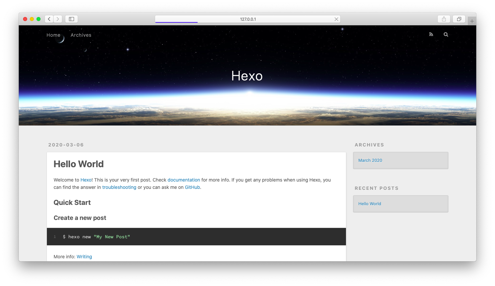
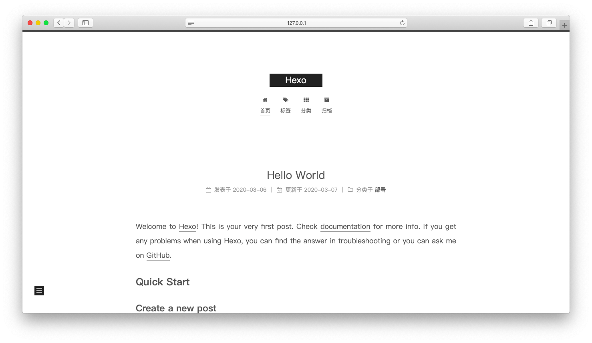

## 0x01 安装hexo环境
hexo需要依赖npm，我使用[nvm](https://github.com/nvm-sh/nvm)来作为npm安装器方便升级npm(在mac和linux上真的好用)

安装好npm后即可
```
npm install hexo-cli -g
```
安装hexo环境

## 0x02 初始化目录
```
 ~ hexo init blog
INFO  Cloning hexo-starter https://github.com/hexojs/hexo-starter.git
Cloning into '/Users/---/blog'...
remote: Enumerating objects: 30, done.
remote: Counting objects: 100% (30/30), done.
remote: Compressing objects: 100% (24/24), done.
remote: Total 161 (delta 12), reused 12 (delta 4), pack-reused 131
Receiving objects: 100% (161/161), 31.79 KiB | 192.00 KiB/s, done.
Resolving deltas: 100% (74/74), done.
Submodule 'themes/landscape' (https://github.com/hexojs/hexo-theme-landscape.git) registered for path 'themes/landscape'
Cloning into '/Users/---/blog/themes/landscape'...
remote: Enumerating objects: 9, done.
remote: Counting objects: 100% (9/9), done.
remote: Compressing objects: 100% (9/9), done.
remote: Total 1063 (delta 1), reused 1 (delta 0), pack-reused 1054
Receiving objects: 100% (1063/1063), 3.22 MiB | 969.00 KiB/s, done.
Resolving deltas: 100% (582/582), done.
Submodule path 'themes/landscape': checked out '73a23c51f8487cfcd7c6deec96ccc7543960d350'
INFO  Install dependencies
yarn install v1.21.1
info No lockfile found.
[1/4] 🔍  Resolving packages...
[2/4] 🚚  Fetching packages...
[3/4] 🔗  Linking dependencies...
[4/4] 🔨  Building fresh packages...
[1/2] ⠁ fsevents
warning Error running install script for optional dependency: "/Users/--/blog/node_modules/fsevents: Command failed.
Exit code: 1
Command: node-gyp rebuild
Arguments:
Directory: /Users/---/blog/node_modules/fsevents
Output:
success Saved lockfile.
✨  Done in 34.93s.
INFO  Start blogging with Hexo!
```
生成目录如下
```
.
├── _config.yml
├── node_modules //hexo的相关依赖插件
│   └── ...
├── package.json
├── scaffolds
│   ├── draft.md
│   ├── page.md
│   └── post.md
├── source  //放个人日志的地方
│   └── _posts
├── themes //自定义主题
│   └── landscape
└── yarn.lock

300 directories, 6 files
```

然后执行
```
hexo s -p 端口
```
即可在浏览器打开


## 0x03 主题美化
我选用[next](https://github.com/theme-next/hexo-theme-next)的主题
安装Installation的方法安装后，把_config.yml中
```
# Extensions
## Plugins: https://hexo.io/plugins/
## Themes: https://hexo.io/themes/
theme: landscape   ------>  next
```


应用主题，再修改语言:
```
# Site
title: Hexo
subtitle: ''
description: ''
keywords:
author: John Doe
language: en  ----->zh-CN
```

## 0x04 添加分类和标签
```
hexo new page categories
INFO  Created: ~/blog/source/categories/index.md
```
将source/categories/index.md文件添加一行type如下
```
---
title: categories
date: 2020-03-07 13:47:20
type: "categories"
---
```
```
hexo new page tags
INFO  Created: ~/blog/source/tags/index.md
```
同理加上tags:
```
---
title: tags
date: 2020-03-07 13:48:47
type: "tags"
---
```
将theme/_config.yml的categories: /categories/ || th和tags: /tags/ || tags注释去掉:
```
menu:
  home: / || home
  #about: /about/ || user
  tags: /tags/ || tags
  categories: /categories/ || th
  archives: /archives/ || archive
  #schedule: /schedule/ || calendar
  #sitemap: /sitemap.xml || sitemap
  #commonweal: /404/ || heartbeat
```
在source/_post/hello-world.md的前面加上categoriesh和tag:
```
---
title: Hello World
categories:
- 部署 
tags:
- hexo
---
```
即可看到效果
