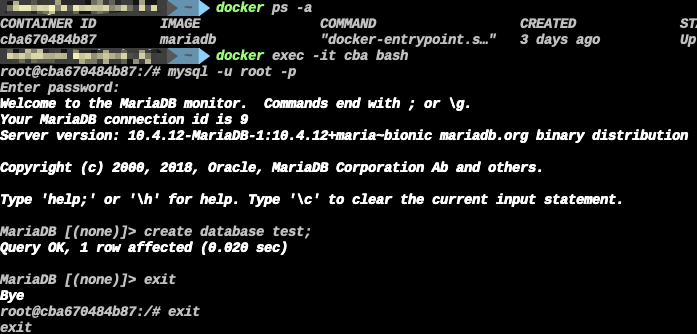
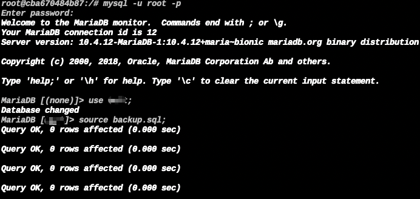
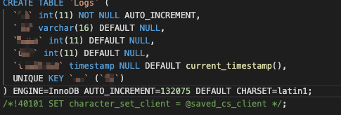
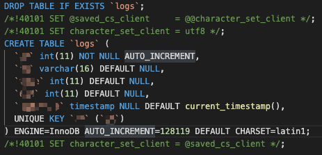
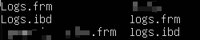
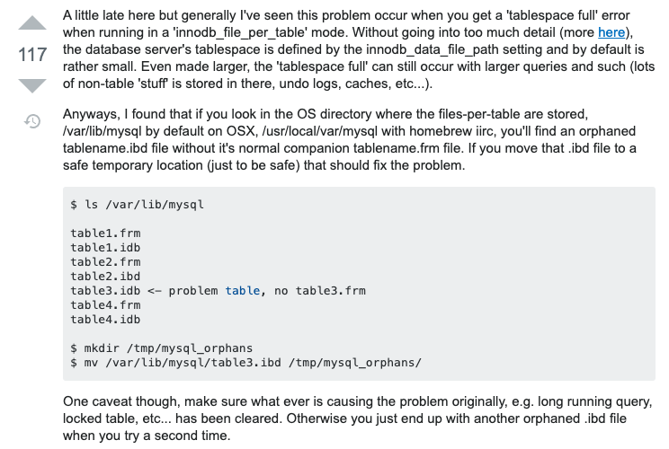
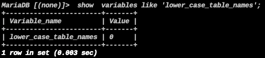
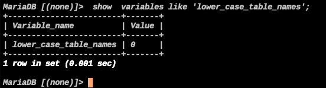
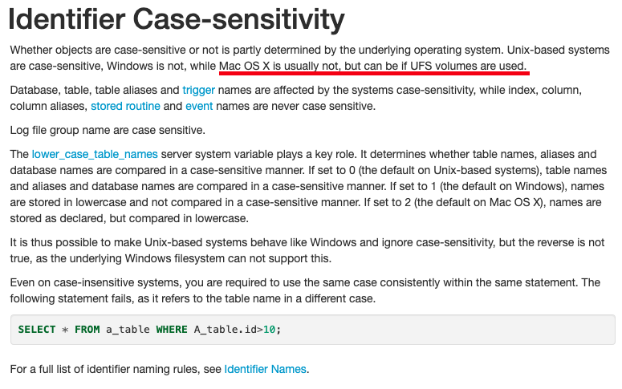

<!-- more --> 

## 0x01

最近打算对一个旧网站进行翻新重写，为了参考以前的架构，将线上的数据库复制一份到本地

一般迁移数据库都是这几个常见方法
```
1.用mysqldump导出sql文件
2.借助第三方软件
3.直接拷贝数据库文件(需要改权限和确保数据库引擎一致)
```
我选用的是第一项(用的比较多

执行
```
docker exec 容器id /usr/bin/mysqldump -u root --password=root 数据库名称 > backup.sql
```


得到了backup.sql文件，将其拷贝回本地

然后在本地导入到容器，新建数据库


导入
```
cat backup.sql | docker exec -i 容器id /usr/bin/mysql -u root --password=root 数据库名称
```
但几秒钟后，失败

```
ERROR 1813 (HY000) at line 104: Tablespace for table '``.`logs`' exists. Please DISCARD the tablespace before IMPORT
```

## 0x02

我们详细执行看看
先将sql文件拷贝到容器内部
```
docker cp backup.sql cba:/
```



看一下sql文件位置




这两个表的名字很相似，只有开头不一样，一个是Logs，一个是logs
但在服务器上是完整的存在



并不像网上所查到的文件缺失


查看大小写是否敏感

本地:



server:


两边均开启

## 0x03

后面想是不是mariadb更新问题，毕竟线上跑的是半年前和朋友一起迁移，于是google了一下，大概知道了什么问题

[链接](https://mariadb.com/kb/en/identifier-case-sensitivity/)



docker mariadb的数据是要永久存储，因此是用挂载的方式，尽管容器内是linux，但似乎依然收到宿主机的磁盘格式影响

## 0x04

于是建个linux虚拟机验证一下
把容器跑起来
```
$ sudo docker-compose up -d
Creating network "switch" with driver "bridge"
Pulling mariadb (mariadb:)...
latest: Pulling from library/mariadb
5bed26d33875: Pull complete
f11b29a9c730: Pull complete
930bda195c84: Pull complete
78bf9a5ad49e: Pull complete
e9e3c043ec68: Pull complete
141e45c6af4b: Pull complete
a26245908a82: Pull complete
40ccaf895c8a: Pull complete
2d665f60c94a: Pull complete
c7bcd9961bee: Pull complete
80f1ddb594ce: Pull complete
0647ec428f9f: Pull complete
9cb6e30e72ca: Pull complete
60890c0035d8: Pull complete
Digest: sha256:d0e2c681c41e91aba6e9c8c0a588eedd48291a70464e83c40da2e3de01998eef
Status: Downloaded newer image for mariadb:latest
Creating mariadb ... done

$ sudo docker ps -a
CONTAINER ID        IMAGE               COMMAND                  CREATED              STATUS              PORTS                    NAMES
c733c7e33571        mariadb             "docker-entrypoint.s…"   About a minute ago   Up About a minute   0.0.0.0:3306->3306/tcp   mariadb
```

创建数据库
```
$ sudo docker exec -it c73 bash
root@c733c7e33571:/# mysql -u root -p
Enter password:
Welcome to the MariaDB monitor.  Commands end with ; or \g.
Your MariaDB connection id is 8
Server version: 10.4.12-MariaDB-1:10.4.12+maria~bionic mariadb.org binary distribution

Copyright (c) 2000, 2018, Oracle, MariaDB Corporation Ab and others.

Type 'help;' or '\h' for help. Type '\c' to clear the current input statement.

MariaDB [(none)]> create database test;
Query OK, 1 row affected (0.000 sec)
```

导入
```
$ sudo docker cp org.sql c73:/

$ sudo docker exec -it c73 bash
root@c733c7e33571:/# ls
bin  boot  dev  docker-entrypoint-initdb.d  docker-entrypoint.sh  etc  home  lib  lib64  media  mnt  opt  org.sql  proc  root  run  sbin  srv  sys  tmp  usr  var
root@c733c7e33571:/# mysql -u root -p test < org.sql
Enter password:
root@c733c7e33571:/#
```

验证
```
root@c733c7e33571:/# mysql -u root -p
Enter password:
Welcome to the MariaDB monitor.  Commands end with ; or \g.
Your MariaDB connection id is 11
Server version: 10.4.12-MariaDB-1:10.4.12+maria~bionic mariadb.org binary distribution

Copyright (c) 2000, 2018, Oracle, MariaDB Corporation Ab and others.

Type 'help;' or '\h' for help. Type '\c' to clear the current input statement.

MariaDB [(none)]> show databases;
+--------------------+
| Database           |
+--------------------+
| information_schema |
| mysql              |
| performance_schema |
| test               |
+--------------------+
4 rows in set (0.001 sec)

MariaDB [(none)]> use test
Reading table information for completion of table and column names
You can turn off this feature to get a quicker startup with -A

Database changed
MariaDB [test]> show tables;
+--------------------------+
| Tables_in_test           |
+--------------------------+
| Logs                     |
| --------------           |
| ----                     |
| logs                     |
| ----------------         |
| ------------------------ |
| -----                    |
+--------------------------+
7 rows in set (0.000 sec)

MariaDB [test]>
```
可以看到在linux上正常，确实是mac的磁盘格式影响

官方所说的ufs格式就不进行测试了

最后附上我的docker mariadb compose文件

docker-compose.yml
```
# Use root/example as user/password credentials
version: "3.7"

services:
  mariadb:
    image: mariadb
    restart: always
    container_name: mariadb
    environment:
      MYSQL_ROOT_PASSWORD: password
    volumes:
      - ./mariadb/data:/var/lib/mysql
      - ./mariadb/config:/etc/mysql/conf.d
      - ./binlog.cnf:/etc/mysql/conf.d/binlog.cnf
    ports:
      - "3306:3306"
    networks:
       switch:
           aliases: 
                - mariadb

networks:
  switch:
    name: switch
    driver: bridge
```

binlog.cnf
```
[mysqld]
character-set-server=utf8
log_bin=/var/lib/mysql/bin-log
log_bin_index=/var/lib/mysql/mysql-bin.index
expire_logs_days=7
server_id=0002
binlog_format=ROW
wait_timeout=31536000
interactive_timeout=31536000
[client]
default-character-set=utf8
```