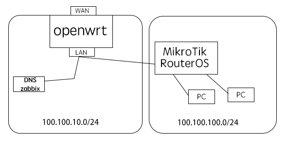
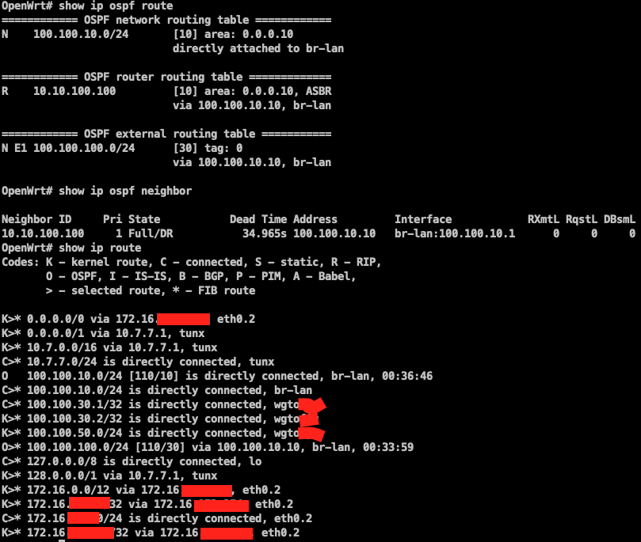
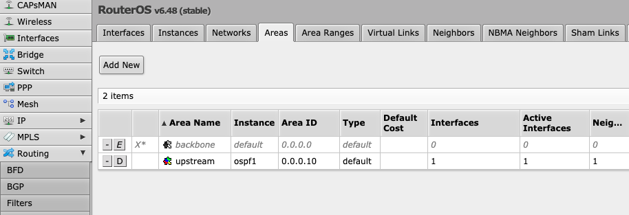
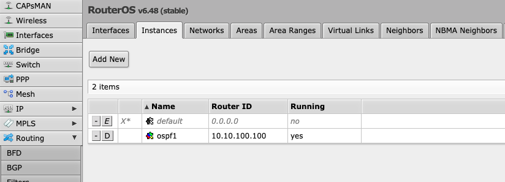
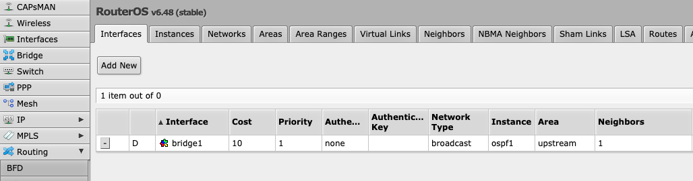
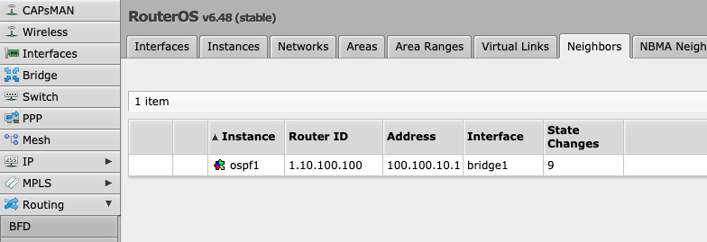
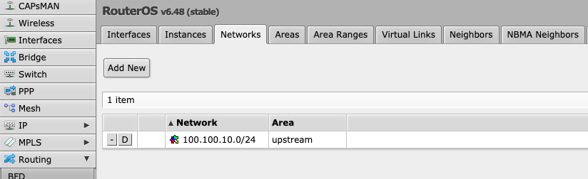
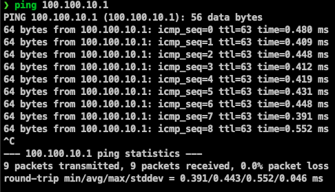
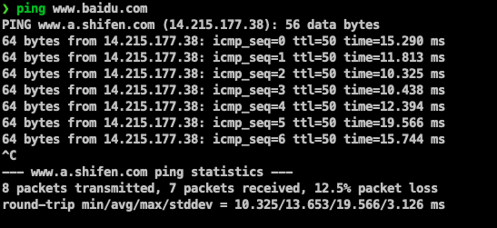

## 前言

使用openwrt的quagga和ros将两个网段通过ospf路由协议进行链接

## 环境设备

- openwrt19(预先编译好quagga，位于network---routing-and-redirection位置)
- ros

## 环境架构



## openwrt配置

1. 通过ssh进入openwrt
2. vtysh进入quagga配置模式
3. 配置ospf

```
router ospf
 ospf router-id 1.10.100.100
 network 100.100.10.0/24 area 0.0.0.10
 default-information originate
```

4. 完整过程如下

- default-information originate 分发默认路由到ros

```
root@OpenWrt:~# vtysh

Hello, this is Quagga (version 1.1.1).
Copyright 1996-2005 Kunihiro Ishiguro, et al.

OpenWrt# configure terminal
OpenWrt(config)# router ospf
OpenWrt(config-router)# ospf router-id 1.10.100.100
OpenWrt(config-router)# network 100.100.10.0/24 area 0.0.0.10
OpenWrt(config-router)# default-information originate
OpenWrt(config-router)# exit
OpenWrt(config)# exit
OpenWrt# show running-config
Building configuration...

Current configuration:
!
!
debug ospf6 lsa unknown
!
password zebra
!
interface br-lan
!
interface br-vlan3
!
interface eth0
!
interface eth0.1
!
interface eth0.2
!
interface eth0.3
!
interface ifb0
!
interface ifb1
!
interface lo
!
interface tunx
!
interface wlan0
!
interface wlan1
!
router ospf
 ospf router-id 1.10.100.100
 network 100.100.10.0/24 area 0.0.0.10
 default-information originate
!
access-list vty permit 127.0.0.0/8
access-list vty deny any
!
ip forwarding
ipv6 forwarding
!
line vty
 access-class vty
!
end
OpenWrt# write
Building Configuration...
Configuration saved to /etc/quagga/zebra.conf
Configuration saved to /etc/quagga/ripd.conf
Configuration saved to /etc/quagga/ripngd.conf
Configuration saved to /etc/quagga/ospfd.conf
Configuration saved to /etc/quagga/ospf6d.conf
Configuration saved to /etc/quagga/bgpd.conf
[OK]
OpenWrt#
```

## 配置ros

- redistribute-connected=as-type-1 是为了将网卡的100.100.100.0/24重分发到ospf路由，而不用宣告这个网段

```
[admin@MikroTik] > routing ospf instance  
[admin@MikroTik] /routing ospf instance> add name=ospf1 router-id=10.10.100.100 redistribute-connected=as-type-1 
[admin@MikroTik] /routing ospf instance> .. 
[admin@MikroTik] /routing ospf> area  
[admin@MikroTik] /routing ospf area> add name=upstream area-id=0.0.0.10 instance=ospf1 
[admin@MikroTik] /routing ospf area> .. 
[admin@MikroTik] /routing ospf> network  
[admin@MikroTik] /routing ospf network> add network=100.100.10.0/24 area=upstream  
[admin@MikroTik] /routing ospf network>
```

## 验证

- openwrt


- ros










- ping openwrt



- ping 百度


