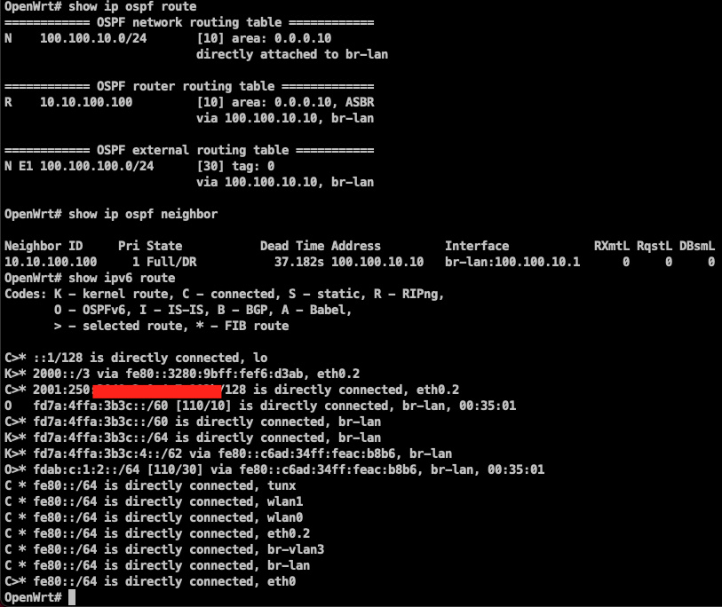
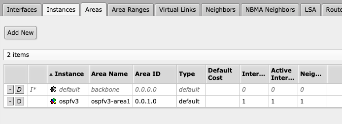
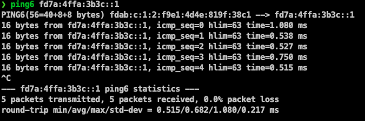

## 前言

使用openwrt的quagga和ros实现ipv6的ospf路由协议

## 环境配置

- openwrt19(预先编译好quagga，位于network---routing-and-redirection位置)
- ros

## 环境架构

- 无奈上层分配到/128的地址无法再继续ra分发，所以内部ipv6自己做了规划，使用nat-ipv6


## openwrt配置

1. 通过ssh进入openwrt
2. vtysh进入quagga配置模式
3. 配置ospf

```
router ospf6
 router-id 1.10.100.100
 area 0.0.1.0 range fd7a:4ffa:3b3c::/64
 interface br-lan area 0.0.1.0
```

在使用ospfv3的interface上添加
```
interface br-lan
 ipv6 ospf6 network broadcast
```

4. 完整配置过程
```
root@OpenWrt:~# vtysh

Hello, this is Quagga (version 1.1.1).
Copyright 1996-2005 Kunihiro Ishiguro, et al.

OpenWrt# configure terminal
OpenWrt(config)# router ospf6
OpenWrt(config-ospf6)# router-id 1.10.100.100
OpenWrt(config-ospf6)# interface br-lan area 0.0.1.0
OpenWrt(config-ospf6)# area 0.0.1.0 range fd7a:4ffa:3b3c::/64
OpenWrt(config-ospf6)# exit
OpenWrt(config)# interface br-lan
OpenWrt(config-if)# ipv6 ospf6 cost 10
OpenWrt(config-if)# exit
OpenWrt(config)# exit
OpenWrt# show running-config
Building configuration...

Current configuration:
!
!
debug ospf6 lsa unknown
!
password zebra
!
interface br-lan
 ipv6 ospf6 network broadcast
!
interface br-vlan3
!
interface eth0
!
interface eth0.1
!
interface eth0.2
!
interface eth0.3
!
interface ifb0
!
interface ifb1
!
interface lo
!
interface tap_soft
!
interface tunx
!
interface wlan0
!
interface wlan1
!
router ospf
 ospf router-id 1.10.100.100
 network 100.100.10.0/24 area 0.0.0.10
 default-information originate
!
router ospf6
 router-id 1.10.100.100
 area 0.0.1.0 range fd7a:4ffa:3b3c::/64
 interface br-lan area 0.0.1.0
!
access-list vty permit 127.0.0.0/8
access-list vty deny any
!
ip forwarding
ipv6 forwarding
!
line vty
 access-class vty
!
end
OpenWrt# write
Building Configuration...
Configuration saved to /etc/quagga/zebra.conf
Configuration saved to /etc/quagga/ripd.conf
Configuration saved to /etc/quagga/ripngd.conf
Configuration saved to /etc/quagga/ospfd.conf
Configuration saved to /etc/quagga/ospf6d.conf
Configuration saved to /etc/quagga/bgpd.conf
[OK]
OpenWrt#
```

## ros的配置

- 自写该文章时，ros的dhcpv6只支持pd模式，无法给dhcpv6-client分配ipv6地址，故使用ra进行无状态分配ip地址
- managed-address-configuration=no 不从dhcpv6获取ipv6地址(因为没有)
- other-configuration=no 不从dhcpv6获取其他信息(原因同上)
- openwrt的quagga不支持下发默认ipv6路由，需要自行手动添加

```
[admin@MikroTik] /ipv6 address> add address=fdad:c:1:2::1/64 advertise=yes interface=vlan3
[admin@MikroTik] /ipv6 address> .. 
[admin@MikroTik] /ipv6> nd 
[admin@MikroTik] /ipv6 nd> add interface=vlan3 advertise-mac-address=yes advertise-dns=no managed-address-configuration=no other-configuration=no
[admin@MikroTik] /ipv6 nd> / 
[admin@MikroTik] > routing ospf-v3  
[admin@MikroTik] /routing ospf-v3> instance  
[admin@MikroTik] /routing ospf-v3 instance> add name=ospfv3 router-id=10.10.100.100 redistribute-connected=as-type-1 
[admin@MikroTik] /routing ospf-v3 instance>  .. 
[admin@MikroTik] /routing ospf-v3> area  
[admin@MikroTik] /routing ospf-v3 area> add area-id=0.0.1.0 name=ospfv3-area1 instance=ospfv3
[admin@MikroTik] /routing ospf-v3 area> .. 
[admin@MikroTik] /routing ospf-v3> area range  
[admin@MikroTik] /routing ospf-v3 area range> add area=ospfv3-area1 range=fd7a:4ffa:3b3c::/64 advertise=no
[admin@MikroTik] /routing ospf-v3 area range> .. 
[admin@MikroTik] /routing ospf-v3 area> .. 
[admin@MikroTik] /routing ospf-v3> interface  
[admin@MikroTik] /routing ospf-v3 interface> add area=ospfv3-area1 interface=bridge1  
```

## 效果

- openwrt



- ros





- ping6 上层



- ping6 外层

